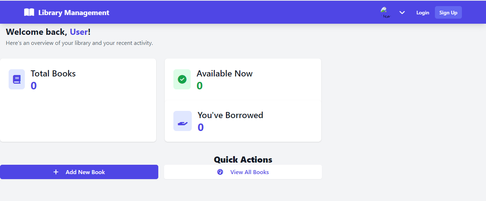

<div align="center">
  
</div>

# 📚 Library Management System

A modern, full-stack web application for managing a personal library, built with **Java 17**, **Groovy**, **Spring Boot 3**, and styled with **Tailwind CSS**. It features secure user authentication (local and Google OAuth2), a RESTful API, and a responsive UI for managing a book collection.

## ✨ Features

- 🔐 **Secure Authentication**: Login with email/password or authenticate via Google OAuth2.
- 📚 **Book Management**: Full CRUD (Create, Read, Update, Delete) operations for books.
- 🔄 **Borrowing System**: Users can borrow and return books, with real-time status tracking.
- 📊 **User Dashboard**: A personalized hub with library statistics and quick actions.
- 🎨 **Modern UI**: Clean, responsive, and professional user interface built with Tailwind CSS.
- 🗄️ **In-Memory Database**: Uses H2 database for fast, out-of-the-box development.
- 🛠️ **RESTful Design**: Clean API structure following best practices.

## 🚀 Live Demo

See the application in action! (Note: Replace with your actual deployed link when you have one)

[

## 🛠️ Tech Stack

| Technology | Description | Purpose |
| :--- | :--- |
| **Java 17** | Core programming language. |
| **Groovy** | Dynamic JVM language for concise and readable code. |
| **Spring Boot 3** | Framework for building production-ready applications. |
| **Spring Security** | Handles authentication and authorization. |
| **Spring Data JPA** | Simplifies database operations. |
| **Thymeleaf** | Modern server-side Java template engine. |
| **Tailwind CSS** | Utility-first CSS framework for rapid UI development. |
| **H2 Database** | In-memory database for easy development. |
| **Gradle** | Build automation tool. |

## 📁 Project Structure

```
library-management-system/
├── build.gradle
├── src/
│   └── main/
│       ├── groovy/
│       │   └── com/example/librarymanagement/
│       ├── config/
│       │   └── SecurityConfig.groovy
│       ├── controller/
│       │   ├── AuthController.groovy
│       │   └── BookController.groovy
│       ├── model/
│       │   ├── Book.groovy
│       │   └── User.groovy
│       ├── repository/
│       │   ├── BookRepository.groovy
│       │   └── UserRepository.groovy
│       └── service/
│           ├── BookService.groovy
│           └── UserService.groovy
└── resources/
    ├── application.properties
    ├── static/
    │   ├── css/
    │   │   └── tailwind.min.css
    │   └── images/
    │       ├── home-page.png
    │       ├── dashboard.png
    │       └── login-page.png
    └── templates/
        ├── layout.html
        ├── home.html
        ├── login.html
        ├── signup.html
        ├── dashboard.html
        └── new-book.html
└── README.md
```

## 🚀 Getting Started

### Prerequisites

*   [JDK 17](https://www.oracle.com/java/technologies/javase/javase17u0/) or later
*   [Gradle 7+](https://gradle.org/install/)

### Installation

1.  **Clone the repository**
    ```bash
    git clone https://github.com/your-username/library-management-system.git
    cd library-management-system
    ```

2.  **Configure Application**
    *   Navigate to `src/main/resources/application.properties`.
    *   Replace the placeholder Google OAuth2 credentials with your own.
        ```properties
        spring.security.oauth2.client.registration.google.client-id=YOUR_GOOGLE_CLIENT_ID
        spring.security.oauth2.client.registration.google.client-secret=YOUR_GOOGLE_CLIENT_SECRET
        ```

3.  **Run the Application**
    ```bash
    ./gradlew bootRun
    ```

4.  **Access the Application**
    *   Open your browser and navigate to `http://localhost:8080`.
    *   The H2 Console is available at `http://localhost:8080/h2-console`.

## 📸 Application Screenshots

### Home Page
A welcoming landing page that showcases featured books and encourages users to sign up.

<div align="center">
  
</div>

### User Dashboard
The main hub for authenticated users, displaying library statistics and book management options.

<div align="center">
  
</div>

### Login Page
A clean and modern login interface with support for both local and Google authentication.

<div align="center">
  
</div>

## 🤝 Contributing

Contributions are what make the open-source community amazing! To contribute:

1.  **Fork the repository.**
2.  **Create a feature branch** (`git checkout -b feature/amazing-feature`).
3.  **Make your changes.**
4.  **Commit your changes** (`git commit -m 'Add some amazing feature'`).
5.  **Push to the branch** (`git push origin feature/amazing-feature`).
6.  **Open a Pull Request.**

## 📄 License

This project is licensed under the MIT License. See the [LICENSE](LICENSE) file for details.

